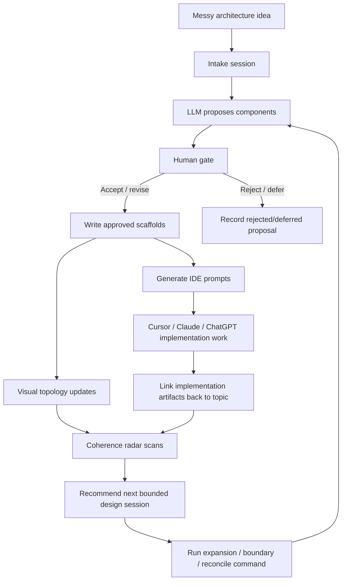
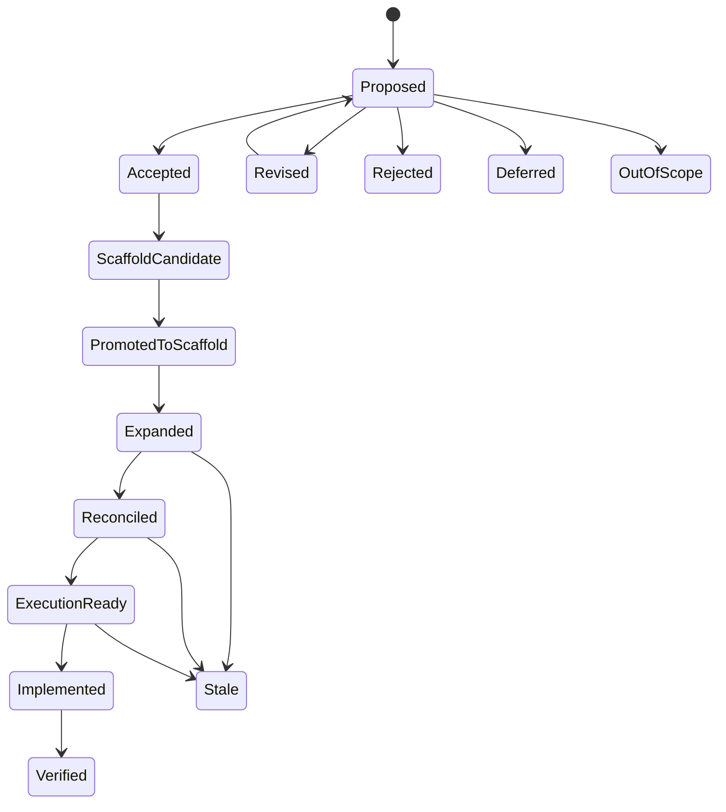

# StrataForge Deep Design Document

**Working name:** StrataForge  
**Alternate names:** Design Crucible, Latticewright, AtlasForge, Scaffoldry  
**Recommended repo path:** `/mnt/scripts/strataforge`  
**Primary product shape:** local-first, IDE-adjacent, human-gated architecture design pairing plane  
**Primary user:** Juniper, working with ChatGPT / Claude / Cursor / local LLMs to decompose, harden, and implement large design systems without drowning in design sprawl.

---

## 1. Executive Summary

StrataForge is a standalone local-first design system workbench for turning sprawling architecture conversations into a navigable, human-approved, agent-readable design topology.

The core experience is not a wiki. It is not a claim ledger. It is not merely a document tree. It is a **gated HITL design session environment** where a human and an LLM buddy collaboratively break large ideas into bounded components, approve or reject each layer, and turn accepted concepts into durable topic scaffolds.

The design artifacts live as Markdown and YAML files in a git-friendly project workspace. A local service provides a visual UI for browsing the tree, running design sessions, reviewing LLM proposals, inspecting design gaps, and linking nodes to IDE work. A CLI gives Cursor, Claude Code, ChatGPT, and other tools stable commands for scaffold creation, validation, status inspection, prompt generation, and eventually session automation.

The motivating pattern is:

```text
messy 10k-foot architecture riff
→ LLM proposes major components
→ human approves / revises / rejects
→ approved components become durable nodes
→ LLM decomposes approved nodes into subcomponents
→ human gates again
→ scaffolds are written only after approval
→ system tracks maturity, coverage, dependencies, gaps, and coherence pressure
→ IDE agents receive bounded prompts to expand, reconcile, or implement one node at a time
```

The product is best understood as:

> **Superpowers-style brainstorming brought to life through an interactive visual and hierarchical pairing plane.**

The human can still do real work in their favorite IDE. StrataForge runs beside the IDE as a visual project map, session cockpit, and coherence radar. It links out to relevant files, branches, prompts, and code review workflows. It continually surfaces important design components so the whole design remains coherent instead of becoming a swamp.

---

## 2. Origin and Problem Statement

Large LLM-assisted design sessions often begin productively and then collapse under their own breadth. A single brainstorm may produce:

```text
5 major concept areas
× 15 sub-concept areas per major area
× 4 sub-sub-concept areas per subarea
= hundreds of latent design topics
```

A raw chat transcript cannot manage that structure. A traditional wiki quickly becomes a swamp. A claim ledger is too atomic and too bureaucratic. Context packs are useful later, but they are not the right first primitive.

The missing primitive is the **topic scaffold** inside a **gated design session**.

The initial Design Atlas idea identified the right substrate:

```text
big idea
→ structured topic tree
→ each topic gets a scaffold
→ agents iteratively fill scaffolds
```

That is still correct, but the refined center of gravity is different:

> The atlas is the artifact store. The design session is the product.

The system should help the human and LLM buddy stay sane while breaking a giant idea into layers. It should provide visual feedback about what exists, what has been approved, what is hollow, what is stale, what conflicts with nearby nodes, what is ready to implement, and what needs another design pass.

---

## 3. Product Thesis

StrataForge is a **local-first, IDE-adjacent design pairing plane** that turns freeform LLM brainstorming into gated, visual, hierarchical architecture sessions.

It keeps a living topic tree, guides human-approved decomposition, generates bounded prompts for coding agents, and continuously surfaces coherence gaps across the design.

The system should answer one recurring question:

> **What is the next bounded design move that keeps the whole structure coherent?**

---

## 4. Non-Goals

StrataForge should explicitly avoid becoming the things it is trying to replace.

### 4.1 Not a claim ledger

Do not extract every sentence as a claim. Do not turn every bullet into a microfact. The system may eventually support claims or decisions, but the first-class unit is the topic/component scaffold.

### 4.2 Not a giant wiki

A wiki is passive. StrataForge is active and gated. Pages exist, but they are embedded inside sessions, statuses, graph views, prompts, and review loops.

### 4.3 Not an autonomous implementation swarm at v0

Agents should not freely build out the whole tree. They should operate on bounded nodes under explicit gates.

### 4.4 Not Orion-first

StrataForge should be standalone. Orion can consume it later, but the project should not depend on Orion services, GraphDB, memory subsystems, or cognitive infrastructure.

### 4.5 Not MCP-first

MCP can be added later as a tool surface. The durable source of truth should be files plus a local API/CLI.

### 4.6 Not vector-search-first

Embeddings can help later, but v0 should not depend on vector search. Tree topology, explicit links, YAML metadata, and scoped context windows are enough to begin.

### 4.7 Not a doc generator

The goal is not to generate polished documents. The goal is to run design sessions and preserve approved structure.

---

## 5. Core Concepts

### 5.1 Project

A project is a StrataForge workspace.

Example:

```text
/mnt/scripts/strataforge/workspaces/orion-redesign/
```

A project contains:

```text
strata.yaml
areas/
sessions/
decisions/
links/
.strata/
```

The project is git-friendly and should remain usable without the UI.

### 5.2 Atlas / Topology

The atlas is the structural map of the design.

It records areas, topics, subtopics, leaves, dependencies, feeds-into links, statuses, and source paths.

The atlas is not a database-only object. It is represented in `strata.yaml` and topic frontmatter.

### 5.3 Topic / Component Scaffold

A topic scaffold is the atomic durable design unit.

It answers:

```text
What is this component?
Where does it fit?
What are its boundaries?
What children does it have?
What decisions exist?
What is unresolved?
What should an agent do next?
```

A scaffold is Markdown with YAML frontmatter.

### 5.4 Design Session

A design session is a human-gated interaction loop around one goal:

```text
intake
component proposal
human review
approved decomposition
scaffold generation
expansion
reconciliation
execution readiness
```

Sessions are first-class objects and should be replayable.

### 5.5 Proposal

A proposal is an LLM-suggested design change that is not yet durable architecture.

Examples:

```text
new component
renamed component
split component
merge two nodes
mark node out of scope
add dependency
promote to execution_ready
```

Proposals require human action before being committed.

### 5.6 Gate

A gate is a required human review point. No durable structural change should occur beyond the current gate unless approved.

### 5.7 LLM Buddy

The LLM buddy is a design partner that proposes decomposition, critiques boundaries, identifies risks, detects overlaps, suggests next sessions, and generates bounded prompts.

The LLM buddy is not the owner of the design. The human owns the gates.

### 5.8 Coherence Radar

The Coherence Radar continuously scans the atlas for pressure points:

```text
central but unresolved nodes
stale nodes
parent/child contradictions
dependency hotspots
unreviewed scaffolds
execution-ready topics with no implementation link
implemented files with no design approval
hollow areas pretending to be mature
```

It does not randomly yank attention. It produces a ranked review queue.

### 5.9 IDE Bridge

The IDE bridge links topics to real files, branches, commits, prompts, and code review flows.

The IDE remains the workbench. StrataForge is the map/session cockpit.

---

## 6. Core User Experience

### 6.1 Start with a messy architecture idea

The human pastes a freeform architecture riff into StrataForge.

Example:

```text
I want a system for gated HITL design sessions where an LLM buddy helps decompose big architecture ideas into components, maintains a visual tree, links into my IDE, and keeps checking coherence across the project.
```

### 6.2 LLM proposes top-level components

The LLM buddy proposes a bounded list of components:

```text
1. Session Runtime
2. Topic Scaffold Store
3. Visual Pairing Plane
4. LLM Buddy Command Palette
5. Coherence Radar
6. IDE Bridge
7. Skill Packs
8. Agent Runtime
```

Each proposed component includes a reason, boundary, possible children, risks, and suggested action.

### 6.3 Human reviews the proposal

For each proposed component, the UI offers:

```text
Accept
Rename
Revise
Split
Merge
Reject
Mark out of scope
Defer
```

Nothing becomes durable until the human approves it.

### 6.4 Approved components become scaffolds

Accepted components are written to Markdown scaffolds and registered in `strata.yaml`.

Rejected and deferred components remain in the session log but do not become active architecture.

### 6.5 Human chooses a component to decompose

The user selects one approved component, such as `Session Runtime`.

The LLM buddy reads:

```text
project manifest
current component
parent context
children, if any
nearby dependencies
session history relevant to the node
```

It proposes children only for that component.

### 6.6 Repeat gated decomposition

The system repeats:

```text
proposal
human review
durable write
summarize
coherence scan
next suggested session
```

### 6.7 Use IDE for real work

When a topic is ready for implementation, the UI generates a Cursor / Claude Code prompt with bounded context and opens related files.

The user continues coding in their IDE. StrataForge tracks the link between design nodes and implementation artifacts.

---

## 7. The Central Loop



---

## 8. Information Architecture

### 8.1 Workspace layout

```text
/mnt/scripts/strataforge/
  README.md
  pyproject.toml
  docker-compose.yml
  .env.example

  strataforge/
    __init__.py
    cli.py
    models.py
    config.py
    logging.py

    core/
      manifest.py
      topic_store.py
      session_store.py
      proposal_store.py
      status.py
      validation.py
      ids.py
      paths.py

    parser/
      outline_parser.py
      markdown_parser.py
      frontmatter.py

    llm/
      providers.py
      buddy.py
      prompts.py
      structured_outputs.py
      summarizer.py
      gap_scanner.py
      coherence.py

    server/
      app.py
      routes_projects.py
      routes_topics.py
      routes_sessions.py
      routes_proposals.py
      routes_radar.py
      routes_prompts.py
      routes_links.py

    ui/
      package.json
      src/
        App.tsx
        api.ts
        components/
          ProjectShell.tsx
          AtlasTree.tsx
          PairingPlane.tsx
          SessionPanel.tsx
          ProposalCard.tsx
          CoherenceRadar.tsx
          TopicEditor.tsx
          StatusHeatmap.tsx
          GapBoard.tsx
          IdeBridgePanel.tsx
          CommandPalette.tsx
          DependencyGraph.tsx

    skills/
      claude/
        strataforge/
          SKILL.md
          reference.md
          templates/
          scripts/
      chatgpt/
        strataforge.skill.md
      cursor/
        rules.md
        prompts/

    templates/
      project_readme.md
      strata.yaml
      topic.md
      area_index.md
      session_summary.md
      expansion_prompt.md
      reconciliation_prompt.md
      code_review_prompt.md
      boundary_check_prompt.md

  workspaces/
    demo/
      strata.yaml
      areas/
      sessions/
      decisions/
      links/
      .strata/
        strata.db
        cache/
        summaries/
        radar/
```

### 8.2 Project workspace layout

```text
workspaces/my-project/
  strata.yaml
  README.md

  areas/
    01-runtime/
      index.md
      01-session-gates.md
      02-proposal-engine.md
      03-status-transitions.md

    02-visual-plane/
      index.md
      01-atlas-tree.md
      02-pairing-panel.md
      03-coherence-radar.md

  sessions/
    2026-05-20-session-runtime-intake.md
    2026-05-20-session-gates-boundary-check.md

  decisions/
    decision-0001-source-of-truth.md
    decision-0002-no-autonomous-write-without-gate.md

  links/
    implementation-links.yaml

  .strata/
    strata.db
    summaries/
      atlas-summary.md
      topic.runtime.session-gates.md
    radar/
      latest.json
```

---

## 9. Source of Truth Strategy

### 9.1 Files are authoritative

The source of truth should be:

```text
strata.yaml
topic markdown files
session markdown/json files
decision records
implementation link records
```

The database is an index/cache used for fast UI queries.

### 9.2 Why local-first files

This preserves:

```text
git diffs
human editability
agent readability
portability
backup simplicity
IDE compatibility
low operational burden
```

### 9.3 SQLite as derived index

SQLite stores:

```text
topic index
proposal index
session index
status counts
cached summaries
radar metrics
searchable text
```

If the DB is deleted, it can be rebuilt from files.

### 9.4 Future vector index

A vector index may be added later for semantic recall, but it should remain derived.

---

## 10. Topic Scaffold Format

### 10.1 YAML frontmatter

```markdown
---
id: topic:runtime.session-gates
title: Session Gates
kind: topic
level: leaf
parent: topic:runtime
path: areas/01-runtime/01-session-gates.md
status: expanded
review_state: needs_revision

proposal_state: promoted_to_scaffold

coverage:
  concept_addressed: true
  concept_solved: false
  out_of_scope: false
  needs_design: true
  needs_reconciliation: true
  needs_code_review: false
  needs_implementation: true

depends_on:
  - topic:runtime.proposal-engine
feeds_into:
  - topic:agent-runtime.write-policy
  - topic:visual-plane.approval-actions
blocks:
  - topic:agent-runtime.autonomous-expansion

owners:
  - juniper
  - llm-buddy

ide_links:
  workspace: /mnt/scripts/strataforge
  related_files:
    - strataforge/core/status.py
    - strataforge/server/routes_sessions.py
    - strataforge/ui/src/components/SessionPanel.tsx
  branch: feature/session-gates
  commits: []

created_at: 2026-05-20
updated_at: 2026-05-20
last_reviewed: null
---
```

### 10.2 Markdown body

```markdown
# Session Gates

## Purpose

What this topic/component is responsible for.

## Boundary

### Includes

- ...

### Excludes

- ...

## Current Design

The currently accepted design.

## Children

- ...

## Interfaces

Inputs, outputs, APIs, events, file contracts, or UI affordances.

## Decisions

- DEC-0001: ...

## Open Questions

- ...

## Risks

- ...

## Implementation Sketch

- ...

## Parent Impact Notes

What this topic implies for its parent.

## Sibling Impact Notes

What this topic implies for nearby siblings.

## Agent Next Actions

- Run `/boundary-check`
- Run `/reconcile-parent`
- Generate implementation prompt
```

### 10.3 Scaffold minimality

A scaffold may begin mostly empty. That is acceptable.

The goal is not to fill everything at once. The goal is to preserve a stable door into the topic.

---

## 11. Status and Review Model

A central mistake to avoid: do not collapse all states into one `status` field.

Use separate axes.

### 11.1 Design maturity status

```yaml
status:
  - scaffolded        # exists, mostly empty
  - expanded          # first substantial design pass completed
  - reconciled        # checked against parent/siblings/dependencies
  - execution_ready   # specific enough for implementation prompt
  - implemented       # code exists and linked
  - verified          # implementation was tested or reviewed
  - stale             # contradicted by newer design/code
```

### 11.2 Proposal state

```yaml
proposal_state:
  - proposed
  - accepted
  - revised
  - rejected
  - out_of_scope
  - deferred
  - promoted_to_scaffold
```

### 11.3 Human review state

```yaml
review_state:
  - unreviewed
  - accepted
  - needs_revision
  - rejected
  - out_of_scope
  - duplicate
  - split_needed
```

### 11.4 Coverage flags

```yaml
coverage:
  concept_addressed: true
  concept_solved: false
  out_of_scope: false
  needs_design: true
  needs_reconciliation: true
  needs_code_review: false
  needs_implementation: true
```

### 11.5 Why these are separate

A component can be:

```yaml
proposal_state: promoted_to_scaffold
status: scaffolded
review_state: accepted
```

Or:

```yaml
proposal_state: accepted
status: expanded
review_state: needs_revision
```

Or:

```yaml
proposal_state: out_of_scope
status: null
review_state: out_of_scope
```

Separating these prevents state soup.

---

## 12. Gates

### 12.1 Gate list

```text
Gate 0: Intake accepted
Gate 1: Top-level component review
Gate 2: Subcomponent review
Gate 3: Leaf boundary review
Gate 4: Scaffold write approval
Gate 5: Expansion approval
Gate 6: Reconciliation approval
Gate 7: Execution-readiness approval
Gate 8: Implementation link approval
Gate 9: Verification approval
```

### 12.2 Gate principles

- LLMs may propose.
- Humans approve.
- Structural writes require approval.
- Status promotion requires approval.
- Rejected ideas are preserved in session logs but not active topology.
- Deferred ideas can reappear in future radar recommendations.
- Out-of-scope ideas should remain visible enough to prevent rediscovery churn.

### 12.3 Gate transitions



---

## 13. Session Model

### 13.1 Session file

A session can be stored as Markdown with frontmatter plus structured blocks, or as JSON plus a rendered Markdown summary.

Recommended: both.

```text
sessions/
  2026-05-20-runtime-session-gates.json
  2026-05-20-runtime-session-gates.md
```

JSON is for tooling. Markdown is for humans and agents.

### 13.2 Session schema

```yaml
id: session:2026-05-20-runtime-gates
project_id: project:strataforge
title: Runtime Session Gates Boundary Review
topic_id: topic:runtime.session-gates
mode: boundary_check
current_gate: leaf_boundary_review
created_at: 2026-05-20T14:00:00-06:00
updated_at: 2026-05-20T14:40:00-06:00

inputs:
  source_prompt: |
    User wants gated HITL design sessions with an LLM buddy...
  context_files:
    - strata.yaml
    - areas/01-runtime/index.md
    - areas/01-runtime/01-session-gates.md
  commands:
    - /boundary-check

proposals:
  - id: proposal:abc123
    kind: split_component
    title: Split Gate Runtime from Gate UI
    state: accepted
    human_action: accepted
    rationale: ...

outputs:
  summary: ...
  open_questions:
    - ...
  parent_impact_notes:
    - ...
  next_recommended_sessions:
    - /reconcile-parent topic:runtime
```

### 13.3 Session modes

```text
intake
brainstorm
decompose
boundary_check
interface_check
risk_scan
reconcile_parent
reconcile_siblings
execution_plan
code_review_request
gap_scan
status_summary
out_of_scope_check
```

### 13.4 Session replay

The UI should support replaying the sequence:

```text
LLM proposed X
Juniper rejected Y
Juniper renamed Z
System wrote scaffold A
Radar later flagged B
```

This prevents architectural amnesia.

---

## 14. Proposal Model

### 14.1 Proposal kinds

```text
create_component
rename_component
revise_component
split_component
merge_components
reject_component
mark_out_of_scope
defer_component
add_dependency
remove_dependency
add_feeds_into
promote_status
demote_status
add_decision
add_open_question
add_ide_link
request_reconciliation
request_code_review
```

### 14.2 Proposal schema

```yaml
id: proposal:runtime.session-gates.split-001
session_id: session:2026-05-20-runtime-gates
topic_id: topic:runtime.session-gates
kind: split_component
state: proposed

title: Split Gate Runtime from Gate UI Actions
summary: Gate transition logic and approval UI actions are related but should be separate components.

rationale: |
  The runtime owns allowed transitions and durable write rules. The UI owns how a human accepts, rejects, revises, or defers.

proposed_changes:
  create_topics:
    - id: topic:runtime.gate-engine
      title: Gate Engine
    - id: topic:visual-plane.gate-actions
      title: Gate Action Controls

risks:
  - Could over-separate if v0 is too small.

human_review:
  action: null
  note: null
  reviewed_at: null
```

### 14.3 Human actions

```text
accept
accept_with_edits
reject
defer
mark_out_of_scope
request_revision
split
merge
```

---

## 15. LLM Buddy Design

### 15.1 Role

The LLM buddy is not a general chatbot. It is a bounded architectural partner.

Its job is to:

```text
break big ideas into components
propose bounded children
identify unclear boundaries
find overlaps
find missing interfaces
find risks
recommend next sessions
write/update scaffolds after approval
produce IDE prompts
summarize status
```

### 15.2 Behavior rules

The LLM buddy should:

- operate on one active node or session at a time
- avoid redesigning unrelated areas
- distinguish proposal from accepted design
- produce structured outputs
- include rationale and risks
- stop at gates
- avoid status promotion unless requested
- preserve rejected/out-of-scope ideas in session logs
- generate parent-impact notes
- generate sibling-impact notes when relevant

### 15.3 Bounded context recipe

For a topic session, load:

```text
1. Project manifest
2. Current topic file
3. Parent topic file
4. Direct children
5. Sibling names and one-line summaries
6. One-hop dependency neighbors
7. Relevant session history
8. Active command template
```

Do not load:

```text
the whole project
every sibling body
every old session
every implementation file
unrelated areas
```

### 15.4 Structured output example

```yaml
session_mode: boundary_check
topic_id: topic:runtime.session-gates
summary: Session Gates needs clearer separation between gate rules, proposal states, and UI actions.

proposals:
  - kind: split_component
    title: Split Gate Engine from Proposal Review UI
    confidence: high
    rationale: Runtime transition rules and UI action controls have different responsibilities.
    suggested_human_actions:
      - accept
      - revise
      - reject

open_questions:
  - Should deferred proposals remain visible in radar by default?

parent_impact_notes:
  - Runtime parent should describe gate enforcement as a service-level policy, not only UI behavior.

recommended_next_commands:
  - /interface-check
  - /reconcile-parent
```

---

## 16. Command Palette

The command palette turns Superpowers-style workflows into first-class UI actions.

### 16.1 Commands

```text
/brainstorm
/decompose
/boundary-check
/interface-check
/risk-scan
/reconcile-parent
/reconcile-siblings
/request-code-review
/execution-plan
/out-of-scope-check
/gap-scan
/summarize-status
/promote-readiness
/link-implementation
```

### 16.2 Command behavior

Each command defines:

```yaml
name: /boundary-check
description: Check whether a component has a clear boundary and identify overlaps.
required_context:
  - current_topic
  - parent_topic
  - sibling_summaries
  - dependency_neighbors
output_schema:
  - boundary_findings
  - overlap_findings
  - proposed_splits
  - open_questions
  - human_review_actions
write_policy:
  default: proposal_only
```

### 16.3 Example command: `/decompose`

Purpose:

```text
Break the selected component into children without exceeding the requested depth or scope.
```

Context:

```text
current topic
parent summary
existing children
sibling names
relevant open questions
```

Output:

```text
proposed child components
rationale for each
boundaries
possible overlaps
recommended action for each
```

### 16.4 Example command: `/request-code-review`

Purpose:

```text
Generate an IDE-ready code review prompt scoped to the topic and related files.
```

Context:

```text
topic scaffold
implementation links
status
open questions
decisions
acceptance criteria
```

Output:

```text
Cursor/Claude prompt
files to inspect
checks to run
expected findings format
non-goals
```

---

## 17. Coherence Radar

### 17.1 Purpose

Coherence Radar is the system’s continuous sense-making layer.

It should surface places where the design is likely to drift, conflict, hollow out, or become stale.

It should not be noisy. It should produce a small ranked set of pressure points.

### 17.2 Signals

Radar should compute signals such as:

```text
unresolved_open_question_count
age_since_last_review
dependency_degree
blocked_downstream_count
status_mismatch
review_state_mismatch
parent_child_contradiction
sibling_overlap
implementation_without_design
execution_ready_without_acceptance
expanded_without_reconciliation
stale_linked_files
hollow_area_ratio
out_of_scope_recurrence
```

### 17.3 Example radar item

```yaml
topic_id: topic:runtime.session-gates
title: Session Gates
severity: high
reason_codes:
  - high_dependency_degree
  - expanded_without_reconciliation
  - open_boundary_questions
summary: Session Gates blocks several runtime and UI components but has unresolved separation between runtime rules and UI approval controls.
recommended_sessions:
  - /boundary-check
  - /reconcile-parent
```

### 17.4 Radar UI

The right panel can show:

```text
Needs attention
- Session Gates: blocks 5 nodes, boundary unclear
- Prompt Contract: used by 8 nodes, not reconciled
- IDE Bridge: execution-ready but no implementation links
- Skill Packs: design stale after latest command-palette changes
```

### 17.5 Radar scoring

Simple first-pass scoring:

```python
score = 0
score += dependency_degree * 2
score += blocked_downstream_count * 3
score += open_question_count
score += 5 if status == "expanded" and needs_reconciliation else 0
score += 5 if review_state == "needs_revision" else 0
score += 7 if implementation_without_design else 0
score += 4 if days_since_review > 14 else 0
```

Use deterministic scoring first. Add LLM interpretation later.

---

## 18. Visual UI Design

### 18.1 Main layout

```text
┌──────────────────────┬───────────────────────────────┬───────────────────────┐
│ Atlas Tree            │ Active Pairing Session          │ Coherence Radar        │
│                      │                               │                       │
│ ▾ Runtime             │ Topic: Session Gates            │ Needs attention        │
│   ▸ Session Gates     │ Mode: /boundary-check           │ - Boundary unclear     │
│   ▸ Proposal Engine   │                               │ - Blocks 5 nodes       │
│   ▸ Status Machine    │ LLM Buddy Proposal:             │ - Needs reconciliation │
│                      │ Split Gate Engine from UI...    │                       │
│ ▾ Visual Plane        │                               │ Suggested actions      │
│   ▸ Atlas Tree        │ Human Actions:                  │ /reconcile-parent      │
│   ▸ Pairing Panel     │ [Accept] [Revise] [Reject]     │ /request-code-review   │
│   ▸ Radar             │ [Split] [Defer] [Out of scope] │                       │
└──────────────────────┴───────────────────────────────┴───────────────────────┘
```

### 18.2 Primary views

```text
Project Dashboard
Atlas Tree
Active Session
Topic Detail
Status Heatmap
Gap Board
Dependency Graph
Coherence Radar
Prompt Studio
IDE Links
Session History
```

### 18.3 Topic detail page

Sections:

```text
Header
- title
- status
- review state
- coverage badges
- radar health

Body
- purpose
- boundary
- current design
- interfaces
- decisions
- open questions
- risks
- implementation sketch

Side panel
- parent
- children
- dependencies
- feeds_into
- related sessions
- related files
- recommended commands
```

### 18.4 Status heatmap

A table/chart showing counts by state.

```text
Area                 Scaffolded   Expanded   Reconciled   Ready   Implemented   Stale
Runtime              4            6          2            1       0             0
Visual Plane         8            3          0            0       0             0
LLM Buddy            5            5          1            0       0             1
Coherence Radar      2            4          1            1       0             0
```

### 18.5 Gap board

Columns:

```text
Needs Boundary
Needs Interface
Needs Reconciliation
Needs Code Review
Execution Ready
Out of Scope
Stale
```

### 18.6 Dependency graph

Use React Flow in v0/v1.

Graph modes:

```text
local neighborhood
area graph
dependency graph
feeds-into graph
blocked-by graph
implementation-link graph
```

Do not render the entire universe by default.

---

## 19. IDE Bridge

### 19.1 Purpose

The IDE bridge lets the user keep coding in Cursor/Claude Code/etc. while StrataForge remains the visual and design coherence layer.

### 19.2 Topic implementation links

```yaml
implementation:
  workspace: /mnt/scripts/strataforge
  branch: feature/session-gates
  related_files:
    - strataforge/core/status.py
    - strataforge/core/session_store.py
    - strataforge/server/routes_sessions.py
    - strataforge/ui/src/components/SessionPanel.tsx
  test_files:
    - tests/test_session_gates.py
  commits:
    - sha: abc123
      summary: add gate transition validator
  pull_requests: []
```

### 19.3 UI actions

```text
Open related file
Copy Cursor prompt
Copy Claude Code prompt
Copy ChatGPT prompt
Generate code review prompt
Mark implementation observed
Run validation
Link current branch
Link commit
```

### 19.4 Local URL shape

```text
http://localhost:8788/projects/strataforge/topics/topic.runtime.session-gates
http://localhost:8788/projects/strataforge/sessions/session.2026-05-20-runtime-gates
```

### 19.5 Future URI handlers

Later:

```text
strataforge://topic/topic.runtime.session-gates
cursor://file/mnt/scripts/strataforge/strataforge/core/status.py
vscode://file/mnt/scripts/strataforge/strataforge/core/status.py
```

---

## 20. CLI Design

### 20.1 Core commands

```bash
strata init <project-path>
strata scaffold --input <markdown-file>
strata list
strata show <topic-id>
strata validate
strata status
strata radar
strata summarize
strata gaps
```

### 20.2 Session commands

```bash
strata session start --project <path> --title "Runtime gates"
strata session propose --session <id> --mode decompose --topic <topic-id>
strata session accept <proposal-id>
strata session reject <proposal-id>
strata session defer <proposal-id>
strata session out-of-scope <proposal-id>
strata session apply --session <id>
strata session summary <session-id>
```

### 20.3 Prompt commands

```bash
strata prompt expand <topic-id>
strata prompt boundary-check <topic-id>
strata prompt reconcile-parent <topic-id>
strata prompt code-review <topic-id>
strata prompt implementation-plan <topic-id>
```

### 20.4 Link commands

```bash
strata link file <topic-id> strataforge/core/status.py
strata link branch <topic-id> feature/session-gates
strata link commit <topic-id> abc123
strata link test <topic-id> tests/test_session_gates.py
```

### 20.5 Rebuild index

```bash
strata index rebuild
```

This should read files and rebuild `.strata/strata.db`.

---

## 21. API Design

### 21.1 Project endpoints

```http
GET    /api/projects
POST   /api/projects
GET    /api/projects/{project_id}
GET    /api/projects/{project_id}/status
```

### 21.2 Topic endpoints

```http
GET    /api/projects/{project_id}/topics
GET    /api/projects/{project_id}/topics/{topic_id}
PUT    /api/projects/{project_id}/topics/{topic_id}
GET    /api/projects/{project_id}/topics/{topic_id}/neighborhood
GET    /api/projects/{project_id}/topics/{topic_id}/prompts/{command}
```

### 21.3 Session endpoints

```http
POST   /api/projects/{project_id}/sessions
GET    /api/projects/{project_id}/sessions
GET    /api/projects/{project_id}/sessions/{session_id}
POST   /api/projects/{project_id}/sessions/{session_id}/propose
POST   /api/projects/{project_id}/sessions/{session_id}/apply
POST   /api/projects/{project_id}/sessions/{session_id}/summarize
```

### 21.4 Proposal endpoints

```http
GET    /api/projects/{project_id}/proposals
GET    /api/projects/{project_id}/proposals/{proposal_id}
POST   /api/projects/{project_id}/proposals/{proposal_id}/accept
POST   /api/projects/{project_id}/proposals/{proposal_id}/reject
POST   /api/projects/{project_id}/proposals/{proposal_id}/defer
POST   /api/projects/{project_id}/proposals/{proposal_id}/out-of-scope
POST   /api/projects/{project_id}/proposals/{proposal_id}/revise
```

### 21.5 Radar endpoints

```http
GET    /api/projects/{project_id}/radar
POST   /api/projects/{project_id}/radar/scan
GET    /api/projects/{project_id}/gaps
GET    /api/projects/{project_id}/heatmap
```

### 21.6 IDE link endpoints

```http
GET    /api/projects/{project_id}/topics/{topic_id}/links
POST   /api/projects/{project_id}/topics/{topic_id}/links/files
POST   /api/projects/{project_id}/topics/{topic_id}/links/branch
POST   /api/projects/{project_id}/topics/{topic_id}/links/commit
```

---

## 22. Backend Architecture

### 22.1 Services inside one app at first

Do not prematurely split into microservices.

Use one FastAPI app:

```text
strata-api
```

Internal modules:

```text
project manager
topic store
session store
proposal engine
LLM buddy adapter
radar scanner
prompt generator
indexer
```

### 22.2 Worker later

A background worker can be added for:

```text
long LLM calls
radar scans
summary generation
index rebuilds
watching file changes
```

But v0 can be request/response.

### 22.3 LLM providers

Provider abstraction:

```python
class LLMProvider:
    def complete_structured(self, prompt, schema): ...
    def complete_text(self, prompt): ...
```

Initial provider options:

```text
OpenAI-compatible API
Anthropic API
local llama.cpp OpenAI-compatible endpoint
manual paste mode
```

Manual paste mode is important: the system should still work if the LLM call is done outside the service.

### 22.4 Manual paste mode

For v0, the UI can generate a prompt and let the user paste the LLM result back in.

This reduces provider complexity and still validates the workflow.

---

## 23. Docker Design

### 23.1 Compose file

```yaml
services:
  strata-api:
    build:
      context: .
      dockerfile: Dockerfile
    environment:
      - STRATA_WORKSPACE_ROOT=/app/workspaces
      - STRATA_DB_PATH=/app/.strata/strata.db
      - STRATA_LLM_PROVIDER=manual
    volumes:
      - ./workspaces:/app/workspaces
      - ./.strata:/app/.strata
    ports:
      - "8787:8787"

  strata-ui:
    build:
      context: ./strataforge/ui
      dockerfile: Dockerfile
    environment:
      - STRATA_API_BASE=http://localhost:8787
    ports:
      - "8788:80"
    depends_on:
      - strata-api
```

### 23.2 Optional worker

```yaml
  strata-worker:
    build: .
    command: strata worker
    volumes:
      - ./workspaces:/app/workspaces
      - ./.strata:/app/.strata
    depends_on:
      - strata-api
```

### 23.3 URLs

```text
API: http://localhost:8787
UI:  http://localhost:8788
```

---

## 24. Skill Pack Design

### 24.1 Philosophy

Skill packs should not own the runtime. They should teach LLM tools how to interact with StrataForge safely.

Runtime:

```text
CLI/API/files/UI
```

Skill:

```text
procedural workflow instructions
bounded context rules
command templates
status transition rules
```

### 24.2 Claude Code skill layout

```text
.claude/skills/strataforge/
  SKILL.md
  reference.md
  examples.md
  templates/
    boundary_check.md
    reconcile_parent.md
    code_review.md
  scripts/
    strata_status.sh
    strata_topic_context.sh
```

### 24.3 Claude Code SKILL.md sketch

```markdown
---
name: StrataForge Architecture Sessions
description: Use this when working inside a StrataForge project to expand, reconcile, review, or implement a bounded architecture topic. This skill enforces gated HITL topic-scaffold workflow and prevents unrelated redesign.
---

# StrataForge Architecture Sessions

## Core Rule

You are working inside a human-gated architecture atlas. Do not redesign unrelated areas. Do not promote statuses or write durable structural changes unless the user explicitly approves.

## Before Acting

1. Run `strata status`.
2. Run `strata show <topic-id>` if a topic is provided.
3. Read only the current topic, parent, child list, sibling summaries, and one-hop dependencies.

## Allowed Actions

- expand the current topic
- propose changes to parent/siblings
- generate implementation plans
- request code review
- identify gaps

## Forbidden Actions

- create new top-level areas unless requested
- rewrite unrelated topics
- change status casually
- treat proposals as accepted design

## Output Format

Return:
- updated current topic content or patch
- proposals requiring human approval
- parent-impact notes
- open questions
- recommended next command
```

### 24.4 ChatGPT/Codex skill

Same conceptual content, adjusted to ChatGPT skill packaging.

### 24.5 Cursor integration

Use:

```text
.cursor/rules/strataforge.mdc
prompts generated by `strata prompt ...`
```

Cursor should receive focused prompts such as:

```text
You are implementing topic:runtime.session-gates.
Read these files only first...
Do not touch unrelated areas...
Run these tests...
Report findings against the topic acceptance criteria...
```

---

## 25. Prompt Generation

### 25.1 Expansion prompt

Generated by:

```bash
strata prompt expand topic:runtime.session-gates
```

Prompt structure:

```text
You are expanding one StrataForge topic.

Topic:
- id
- title
- status

Read:
- strata.yaml
- current topic
- parent topic
- direct children
- sibling summaries

Do not:
- redesign unrelated areas
- create new top-level areas
- change statuses unless instructed

Task:
- fill purpose
- sharpen boundary
- list interfaces
- identify risks
- add open questions
- add parent-impact notes

Output:
- patch for current topic only
- proposals for other files only
- next recommended command
```

### 25.2 Reconciliation prompt

```text
You are reconciling a parent topic with its children.

Read:
- parent topic
- all direct child summaries
- child open questions
- dependencies among children

Task:
- summarize what children imply
- identify conflicts
- identify missing interfaces
- identify stale sections
- propose parent updates

Do not:
- rewrite children unless explicitly requested
```

### 25.3 Code review prompt

```text
You are reviewing implementation against a StrataForge topic.

Read:
- topic scaffold
- linked implementation files
- linked tests

Check:
- implementation matches accepted boundary
- no out-of-scope behavior slipped in
- status claims are supported by code/tests
- missing tests
- architectural drift

Output:
- findings
- severity
- suggested fixes
- whether topic may be marked implemented/verified
```

---

## 26. Validation Rules

### 26.1 Manifest validation

Check:

```text
all topic IDs unique
all paths exist
all parent references exist
all dependencies exist or are marked external
no cycles unless explicitly allowed
statuses are valid
review states are valid
coverage flags are valid
```

### 26.2 Scaffold validation

Check:

```text
required frontmatter fields
required markdown sections
id matches manifest
parent matches manifest
status transition allowed
implementation links exist if status >= implemented
execution_ready topics have acceptance criteria
```

### 26.3 Session validation

Check:

```text
session has mode
session has topic or intake source
proposal states valid
accepted proposals have human review timestamp
applied proposals have matching file changes
```

### 26.4 Coherence validation

Check:

```text
expanded children with stale parent
execution_ready without reconciliation
implemented without linked files
verified without tests or review notes
out_of_scope topic still depended on by active topics
```

---

## 27. Data Schemas

### 27.1 Project manifest

```yaml
project_id: project:strataforge
title: StrataForge
version: 0.1.0
status: active

levels:
  - area
  - topic
  - subtopic
  - leaf

root_areas:
  - id: topic:runtime
    title: Runtime
    path: areas/01-runtime/index.md
  - id: topic:visual-plane
    title: Visual Pairing Plane
    path: areas/02-visual-plane/index.md

settings:
  require_human_gate_for_scaffold_write: true
  require_human_gate_for_status_promotion: true
  default_llm_mode: manual
  max_decomposition_children: 10
  max_decomposition_depth_per_session: 1
```

### 27.2 Topic object

```yaml
id: topic:runtime.session-gates
title: Session Gates
kind: topic
level: leaf
parent: topic:runtime
path: areas/01-runtime/01-session-gates.md
status: expanded
review_state: needs_revision
coverage: {}
depends_on: []
feeds_into: []
blocks: []
ide_links: {}
created_at: 2026-05-20
updated_at: 2026-05-20
last_reviewed: null
```

### 27.3 Radar item

```yaml
id: radar:topic.runtime.session-gates:2026-05-20
topic_id: topic:runtime.session-gates
severity: high
score: 27
reason_codes:
  - high_dependency_degree
  - expanded_without_reconciliation
  - needs_revision
summary: ...
recommended_commands:
  - /boundary-check
  - /reconcile-parent
created_at: 2026-05-20T14:00:00-06:00
```

---

## 28. MVP Design

### 28.1 MVP name

```text
StrataForge Session v0
```

### 28.2 MVP must support

```text
create project
paste architecture idea
LLM/manual proposal of top-level components
human accept/reject/revise proposals
write approved scaffolds
view topic tree
view topic detail
run validate
generate expansion prompt
generate reconciliation prompt
basic radar scan
```

### 28.3 MVP can skip

```text
real-time collaboration
MCP
full auth
multi-user roles
vector search
background worker
commit introspection
automatic IDE opening
advanced graph layouts
```

### 28.4 MVP acceptance criteria

- I can create `/mnt/scripts/strataforge`.
- I can start a project workspace.
- I can paste a high-level design idea.
- The system can create proposal cards for top-level components.
- I can approve/reject/revise those cards.
- Only approved components become Markdown scaffolds.
- I can browse the resulting tree visually.
- I can select a node and generate a bounded LLM prompt.
- I can mark a node as out of scope / needs design / execution ready.
- I can see a basic radar queue of topics needing attention.
- Re-running scaffold/proposal steps does not overwrite expanded work without explicit force/approval.

---

## 29. Build Phases

### Phase 0: Repo foundation

Deliver:

```text
Python package
CLI skeleton
workspace layout
Markdown/frontmatter parser
manifest loader
basic tests
```

### Phase 1: File substrate

Deliver:

```text
strata init
strata list
strata show
strata validate
basic scaffold templates
status model
review model
```

### Phase 2: Session/proposal model

Deliver:

```text
session create
proposal JSON schema
proposal accept/reject/defer/out-of-scope
apply approved proposals to files
session markdown summary
```

### Phase 3: LLM/manual buddy

Deliver:

```text
manual prompt generation
manual result paste/import
optional OpenAI-compatible provider
structured proposal parsing
```

### Phase 4: Web UI

Deliver:

```text
FastAPI routes
React app
Atlas tree
Topic detail
Session panel
Proposal cards
Approval buttons
```

### Phase 5: Coherence radar

Deliver:

```text
radar deterministic scanner
score/reason codes
radar UI panel
gap board
status heatmap
```

### Phase 6: IDE bridge

Deliver:

```text
related files links
copy Cursor prompt
copy Claude Code prompt
copy code review prompt
implementation links YAML
```

### Phase 7: Skill packs

Deliver:

```text
Claude Code skill
ChatGPT skill draft
Cursor rules
workflow examples
```

### Phase 8: Agent runtime

Deliver later:

```text
job queue
scoped agent runs
HITL approval queue
auto-generated session summaries
controlled apply patches
```

---

## 30. Initial Topic Tree for StrataForge Itself

This is a seed architecture for building StrataForge inside StrataForge.

```text
StrataForge
├── 01 Product Experience
│   ├── Gated Design Sessions
│   ├── Visual Pairing Plane
│   ├── Human Review Actions
│   ├── Command Palette
│   └── IDE Adjacent Workflow
│
├── 02 File Substrate
│   ├── Project Manifest
│   ├── Topic Scaffold Format
│   ├── Session Records
│   ├── Proposal Records
│   └── Decision Records
│
├── 03 Runtime Core
│   ├── Topic Store
│   ├── Session Store
│   ├── Proposal Engine
│   ├── Gate Engine
│   └── Status Transition Validator
│
├── 04 LLM Buddy
│   ├── Prompt Builder
│   ├── Structured Output Parser
│   ├── Decomposition Workflow
│   ├── Boundary Review Workflow
│   ├── Reconciliation Workflow
│   └── Summary Workflow
│
├── 05 Coherence Radar
│   ├── Deterministic Signals
│   ├── Radar Scoring
│   ├── Gap Detection
│   ├── Dependency Hotspots
│   └── Review Queue
│
├── 06 UI
│   ├── Atlas Tree
│   ├── Pairing Plane
│   ├── Proposal Cards
│   ├── Topic Editor
│   ├── Status Heatmap
│   ├── Gap Board
│   ├── Dependency Graph
│   └── IDE Bridge Panel
│
├── 07 CLI and API
│   ├── CLI Commands
│   ├── REST API
│   ├── Index Rebuild
│   ├── Validation Commands
│   └── Prompt Commands
│
├── 08 Skills and External Agents
│   ├── Claude Code Skill
│   ├── ChatGPT Skill
│   ├── Cursor Rules
│   ├── MCP Future Surface
│   └── Agent Runtime Future
│
└── 09 Operations
    ├── Docker Compose
    ├── Local Config
    ├── Backups
    ├── Git Workflow
    └── Security Boundaries
```

---

## 31. Risks and Mitigations

### 31.1 Risk: It becomes a bureaucracy machine

Mitigation:

- Make gates lightweight.
- Allow batch approval.
- Keep proposal cards concise.
- Do not require every tiny text edit to become a formal session.

### 31.2 Risk: It becomes a wiki

Mitigation:

- Make sessions, proposals, radar, and prompts central.
- Treat Markdown as artifact, not whole product.

### 31.3 Risk: LLMs still over-expand

Mitigation:

- Strict bounded context.
- One-depth-per-session default.
- Human gates before durable writes.
- Write scopes in every prompt.

### 31.4 Risk: Too many statuses

Mitigation:

- Keep maturity, proposal, review, and coverage separate.
- Do not add more axes unless absolutely necessary.

### 31.5 Risk: UI is pretty but not useful

Mitigation:

- CLI-first substrate.
- UI actions map to real CLI/API operations.
- Every visual should support a decision or next action.

### 31.6 Risk: Provider integration slows v0

Mitigation:

- Manual paste mode first.
- OpenAI-compatible endpoint second.
- Vendor-specific integrations later.

### 31.7 Risk: It cannot round-trip with IDE work

Mitigation:

- Implementation links from day one.
- Prompt generation from day one.
- Code review prompt from early phase.

---

## 32. Security and Safety Boundaries

### 32.1 File write safety

- Never overwrite non-scaffolded content without approval.
- Require `--force` for destructive CLI operations.
- Keep backups before applying proposals.
- Show diffs before apply when possible.

### 32.2 Agent write safety

- Default agent outputs to proposal-only.
- Require human approval before structural writes.
- Restrict write scope to current topic unless explicitly expanded.

### 32.3 Local network exposure

- Bind to localhost by default.
- Require explicit config for LAN exposure.
- No auth needed for localhost v0, but warn if binding to `0.0.0.0`.

### 32.4 Secret handling

- LLM provider keys live in `.env`, never in topic files.
- Do not write keys into session logs.

---

## 33. Configuration

### 33.1 `.env.example`

```bash
STRATA_WORKSPACE_ROOT=/mnt/scripts/strataforge/workspaces
STRATA_DB_PATH=/mnt/scripts/strataforge/.strata/strata.db
STRATA_HOST=127.0.0.1
STRATA_PORT=8787
STRATA_UI_PORT=8788

STRATA_LLM_PROVIDER=manual
STRATA_OPENAI_BASE_URL=
STRATA_OPENAI_API_KEY=
STRATA_OPENAI_MODEL=

STRATA_REQUIRE_HUMAN_GATE_FOR_WRITES=true
STRATA_REQUIRE_HUMAN_GATE_FOR_STATUS_PROMOTION=true
STRATA_MAX_DECOMPOSITION_CHILDREN=10
STRATA_MAX_DECOMPOSITION_DEPTH_PER_SESSION=1
```

### 33.2 Project settings

```yaml
settings:
  require_human_gate_for_scaffold_write: true
  require_human_gate_for_status_promotion: true
  max_decomposition_children: 10
  max_decomposition_depth_per_session: 1
  radar:
    stale_after_days: 14
    max_items: 10
  ui:
    default_graph_depth: 1
```

---

## 34. Testing Strategy

### 34.1 Unit tests

```text
test frontmatter parse/write
test manifest load/save
test topic ID generation
test status transitions
test proposal state transitions
test scaffold apply safety
test validation errors
test radar scoring
```

### 34.2 Integration tests

```text
init project
create session
import proposals
accept proposal
apply proposal
validate project
generate prompt
run radar scan
```

### 34.3 UI tests

```text
load project dashboard
open atlas tree
open topic detail
start session
review proposal card
accept proposal
see scaffold appear
see radar update
```

### 34.4 Golden file tests

Use fixtures:

```text
fixtures/simple_outline.md
fixtures/expected_strata.yaml
fixtures/expected_topic_scaffold.md
fixtures/session_proposals.json
```

Compare generated files to expected outputs.

---

## 35. Example End-to-End Walkthrough

### Step 1: Initialize

```bash
cd /mnt/scripts
mkdir -p strataforge
cd strataforge
strata init workspaces/strataforge-self
```

### Step 2: Paste intake idea

The user enters:

```text
I want a standalone visual HITL design pairing plane where an LLM buddy helps decompose architecture ideas into approved scaffolds, links into my IDE, and continually checks coherence.
```

### Step 3: LLM proposes components

Proposal cards appear:

```text
Session Runtime
Topic Scaffold Store
Visual Pairing Plane
LLM Buddy Commands
Coherence Radar
IDE Bridge
Skill Packs
Agent Runtime Future
```

### Step 4: Human reviews

The user accepts:

```text
Session Runtime
Topic Scaffold Store
Visual Pairing Plane
Coherence Radar
IDE Bridge
```

The user defers:

```text
Agent Runtime Future
```

The user revises:

```text
LLM Buddy Commands → Command Palette and Prompt Engine
```

### Step 5: Apply proposals

Approved proposals create files:

```text
areas/01-session-runtime/index.md
areas/02-topic-scaffold-store/index.md
areas/03-visual-pairing-plane/index.md
areas/04-command-palette-prompt-engine/index.md
areas/05-coherence-radar/index.md
areas/06-ide-bridge/index.md
```

### Step 6: Select Session Runtime

Run `/decompose`.

LLM proposes:

```text
Gate Engine
Proposal Engine
Session Store
Status Transition Validator
Apply Engine
```

Human accepts/revises.

### Step 7: Radar scan

Radar says:

```text
Gate Engine needs boundary check before Proposal Engine can be execution-ready.
Command Palette depends on Prompt Engine, but Prompt Engine is only scaffolded.
IDE Bridge has no file-link schema yet.
```

### Step 8: Generate Cursor prompt

The user clicks:

```text
Copy Cursor Prompt → Implement Gate Engine v0
```

Prompt includes:

```text
current topic
parent topic
accepted decisions
related files
tests to add
non-goals
acceptance criteria
```

---

## 36. Initial Cursor Build Prompt

Use this when ready to start implementation.

```text
Build StrataForge Session v0 in /mnt/scripts/strataforge.

Goal:
Create a standalone local-first HITL architecture design pairing plane. It should support project workspaces, topic scaffolds, gated design sessions, proposal review, and safe scaffold generation. Do not integrate Orion. Do not build autonomous agents yet.

Implement first:
1. Python package with CLI named `strata`.
2. Project workspace initialization.
3. `strata.yaml` manifest support.
4. Markdown topic scaffold format with YAML frontmatter.
5. Session and proposal JSON schemas.
6. Human review state machine for proposals.
7. Safe apply: accepted proposals create scaffold files; rejected/deferred/out-of-scope do not.
8. Commands:
   - strata init <path>
   - strata list
   - strata show <topic-id>
   - strata validate
   - strata session start
   - strata session import-proposals <json>
   - strata proposal accept <proposal-id>
   - strata proposal reject <proposal-id>
   - strata proposal defer <proposal-id>
   - strata apply <session-id>
   - strata prompt expand <topic-id>
   - strata radar
9. Minimal FastAPI service exposing project/topic/session/proposal/radar endpoints.
10. Minimal React UI with Atlas Tree, Topic Detail, Session Panel, Proposal Cards, and Coherence Radar.

Source of truth:
- Files are authoritative.
- SQLite can be used as a derived index/cache but must be rebuildable.

Safety:
- Do not overwrite non-scaffolded files without --force.
- Do not promote statuses without explicit human action.
- Treat LLM outputs as proposals only.

Acceptance:
- I can initialize a project.
- I can import a set of proposed components.
- I can accept/reject/defer proposals.
- Applying a session writes only accepted scaffolds.
- The UI shows the resulting tree and proposal states.
- `strata validate` catches missing parents, duplicate IDs, invalid statuses, and broken paths.
- `strata radar` shows at least deterministic findings for stale, unreconciled, and high-dependency topics.
```

---

## 37. Future Extensions

### 37.1 MCP server

Expose tools:

```text
list_projects
get_topic
get_topic_context
start_session
submit_proposal
accept_proposal
apply_session
generate_prompt
run_radar
```

### 37.2 Local LLM integration

Use local OpenAI-compatible endpoints for:

```text
proposal generation
summaries
radar interpretation
prompt drafting
```

### 37.3 Git awareness

Add:

```text
current branch detection
changed files by topic
commit links
diff summary
implementation drift detection
```

### 37.4 Multi-project atlas

Allow multiple projects and cross-project links.

### 37.5 Orion integration

Later, Orion can consume StrataForge as:

```text
design memory
goal substrate
project planning graph
agent task queue
coherence review surface
```

But StrataForge should remain standalone.

---

## 38. Final Product Definition

StrataForge is:

> A local-first, IDE-adjacent design pairing plane that turns freeform LLM brainstorming into gated, visual, hierarchical architecture sessions. It keeps a living topic tree, guides human-approved decomposition, generates bounded prompts for coding agents, and continuously surfaces coherence gaps across the design.

The key invention is not the Markdown scaffold alone.

The key invention is the loop:

```text
LLM proposes structure
human gates structure
accepted structure becomes durable topology
radar keeps topology coherent
IDE agents act on bounded nodes
```

This gives the human a way to build huge conceptual systems without letting the design become a swamp.
